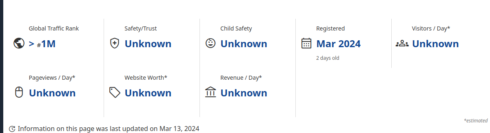
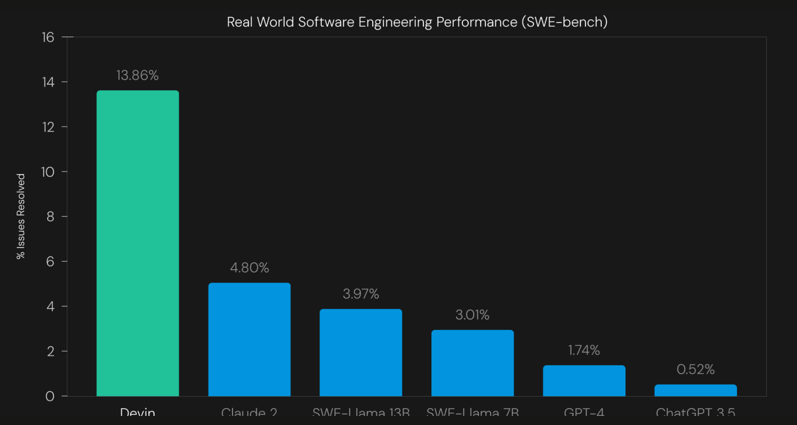
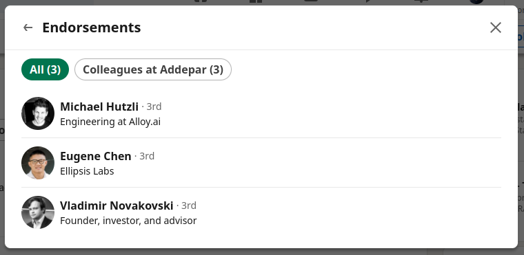
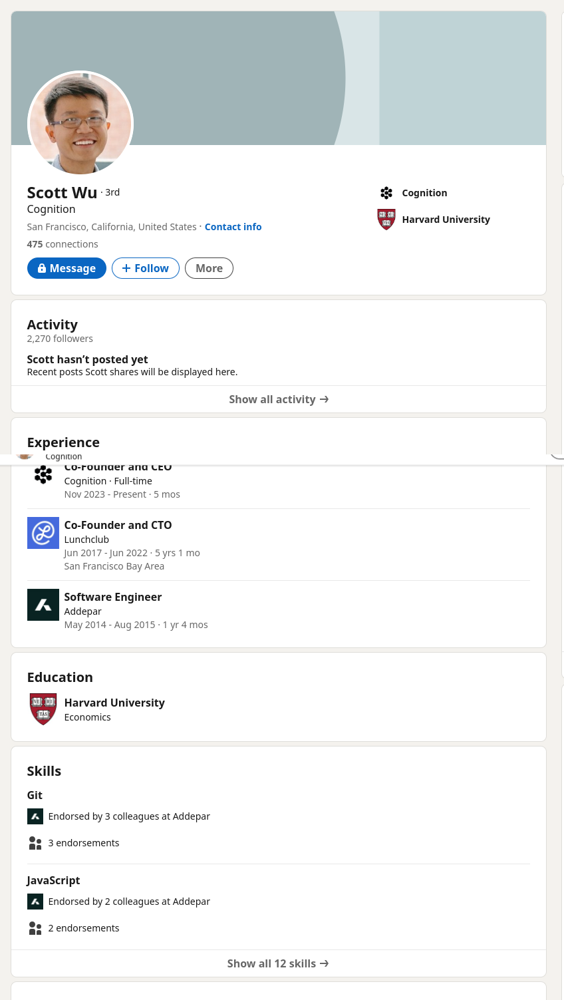
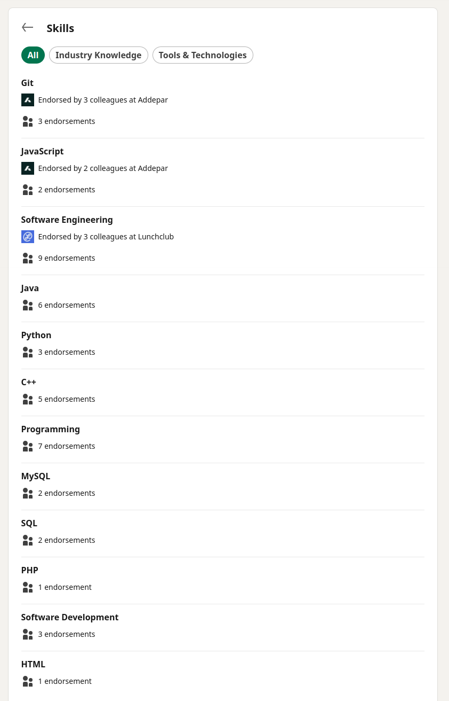
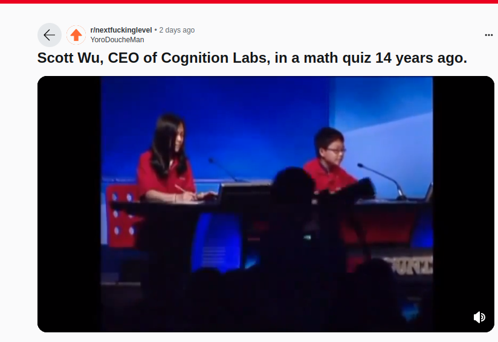
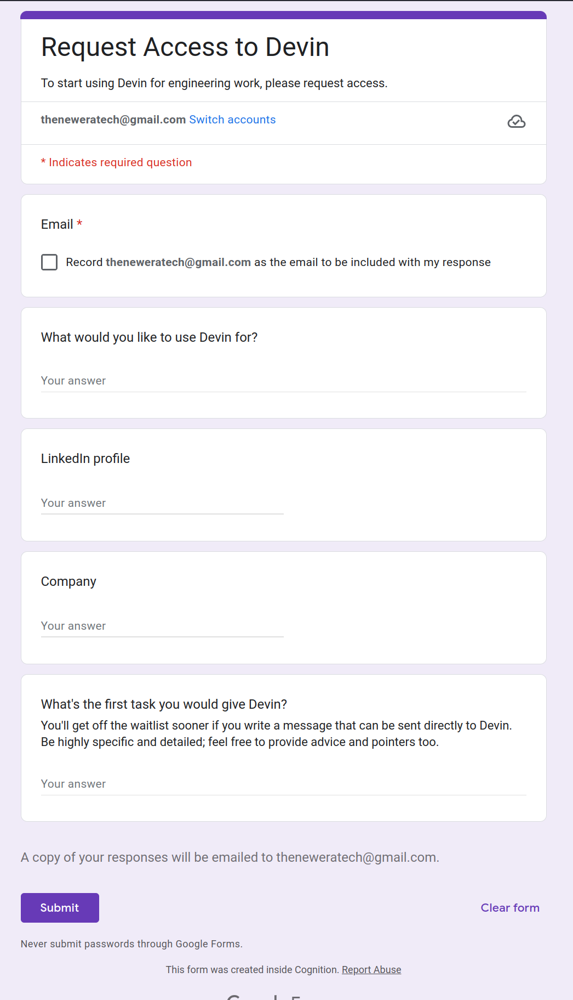
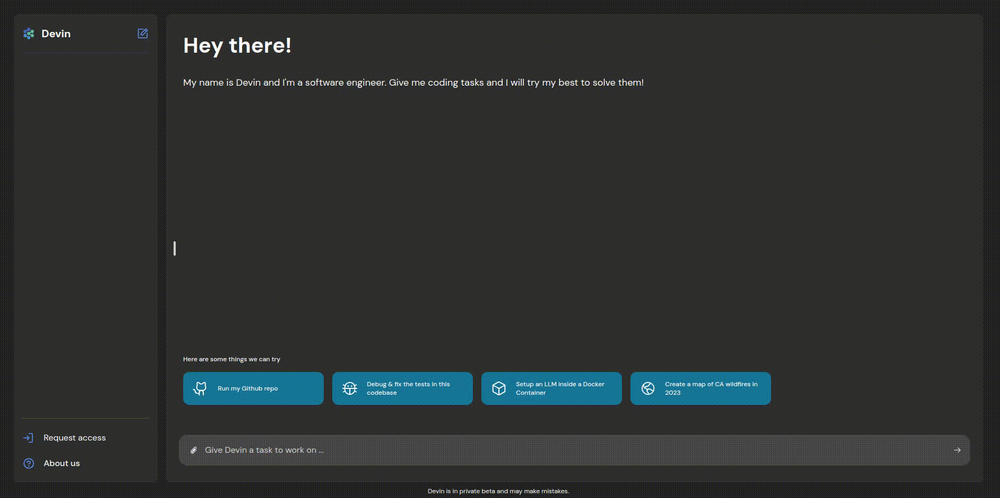
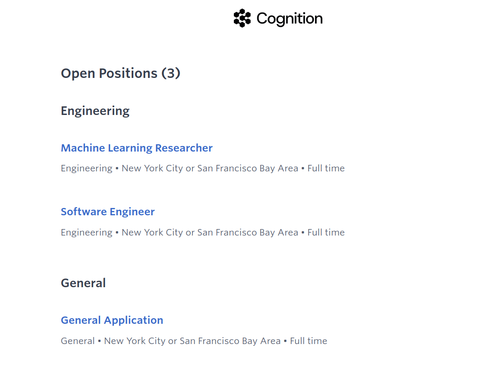
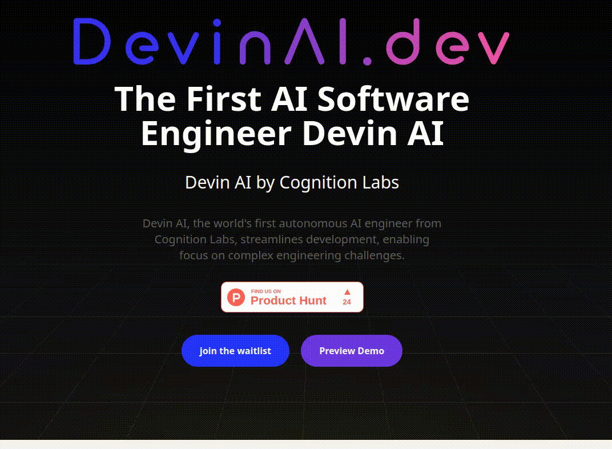

# DevinAI . dev

## 1. Website

- using images for stats
- using images fro stats

## 2. LinkedIn Profile for CEO is too new

- they are trying to reach 500+
- skillset does not match of an AI engineer

## 3. Activity

- someone posted a video of "Scott Wu" 's math quiz "14 years go".
- video is a fake it is visible

- https://www.reddit.com/r/nextfuckinglevel/comments/1bdbm7x/scott_wu_ceo_of_cognition_labs_in_a_math_quiz_14/

- most probably the introduction video is also a fake
- generated the same way

## 4. Registeration

- they are using "google forms" for waitlist registeration
- why are they asking **What's the first task you would give Devin?**

## 5. Demo Page

- Demo page does not work

## 6. Hiring

- Hiring page is a fake
- it is a page built on [Ashbayhq](https://jobs.ashbyhq.com/cognition). Why an organization does not even have a website ?
- website cognition.com leads to a linkedin page, which is a fake

## 7. How i Know it is a fake:

- I am a full stack web developer with over 5 years of industrial experience
- I knew it is a fake when i hovered oer first button.

- then i found many other issues with site
- so i digged a bit deeper